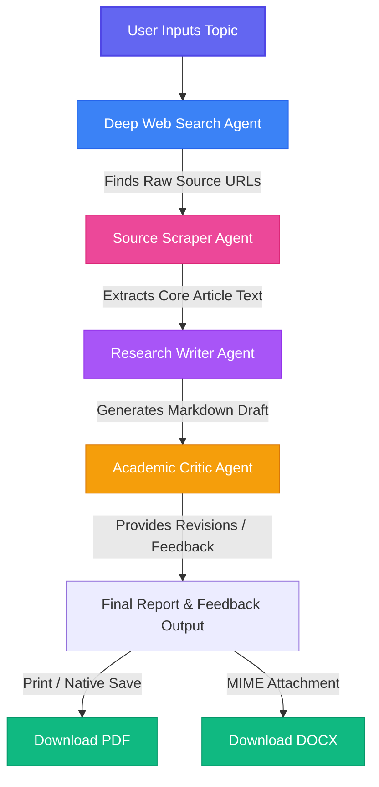

# Multi-Agent Research Laboratory

An advanced collaborative multi-agent platform designed to automate deep research workflows. The system features collaborative LangChain agents performing real-time web search, content scraping, synthesis, and peer evaluation, with live console logs streamed directly to a responsive React dashboard.

## 🔄 Agent Workflow

The system utilizes specialized agents interacting in a pipeline, visualized below:



---

## ✨ Features

* **Deep Web Search:** Crawls and retrieves fresh, relevant articles using Tavily.
* **Source Scraper:** Extracts deep, clean body text directly from source web pages.
* **Research Writer:** Synthesizes extracted text into a well-structured, formatted Markdown draft.
* **Academic Critic:** Critically evaluates the draft and provides comprehensive recommendations.
* **Live SSE Streaming:** Real-time console logs and incremental report updates are pushed directly to the dashboard.
* **Clean Exports:** Generate and download high-quality PDFs (via native browser print layouts) or Word documents (DOCX).

---

## 🛠️ Tech Stack

### Backend
* **Python 3.10+ / FastAPI:** High-performance web server handling Server-Sent Events (SSE).
* **LangChain:** Coordinates the agent steps and orchestrates the LLM interaction.
* **Tavily API:** Specialized web search optimized for AI agents.
* **Uvicorn:** ASGI web server.

### Frontend
* **React 18 & TypeScript:** Strict, component-driven UI architecture.
* **TailwindCSS:** Modern utility classes with a vibrant dark-mode console theme.
* **Vite:** High-speed building and dev tooling.

---

## ⚙️ Setup & Installation

### Prerequisite: Set up environment variables
Create a `.env` file in the root directory:
```env
TAVILY_API_KEY="your_tavily_key"
GROQ_API_KEY="your_groq_key"
GOOGLE_API_KEY="your_google_key"
```

### 1. Run the Backend
```bash
# Navigate to the backend directory
cd backend

# Create a virtual environment & activate it
python -m venv .venv
source .venv/bin/activate  # On Windows: .venv\Scripts\activate

# Install dependencies
pip install -r requirements.txt

# Start the API server
uvicorn app.main:app --reload
```
The backend server runs at `http://localhost:8000`.

### 2. Run the Frontend
```bash
# Navigate to the frontend directory
cd frontend

# Install package dependencies
npm install

# Start the development server
npm run dev
```
The client runs at `http://localhost:5173`.

---

## 🚢 Production Deployment

### Backend (Render Web Service)
* **Build Command:** `pip install -r backend/requirements.txt`
* **Start Command:** `uvicorn backend.app.main:app --host 0.0.0.0 --port $PORT`
* Remember to add your API keys under **Environment Variables** in Render's dashboard.

### Frontend (Render Static Site)
* **Root Directory:** `frontend`
* **Build Command:** `npm run build`
* **Publish Directory:** `dist`
